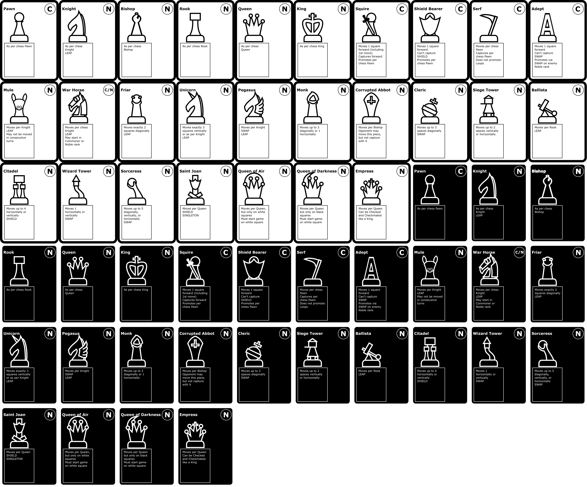

# Chess with Points
This is for the Game Design certificate at UW in 2026. The rules, names, commoner/noble designations of each piece were not created by me and will be credited once I find the right person/group to credit. 

No AI was used in the creation of these cards, just MI (meaty intelligence).

# Importing to Tabletop Simulator
- Download [cards.png](cards.png)
- Open Tabletop Simulator and create a sandbox room
- Select **Objects** from the top menu and **Components** from the dialog box that brings up.

- Select Custom Deck, place the deck on the table, **then hit escape** to get the import dialog box to pop up.

- Find cards.png on your computer and upload it as both the fronts and backs of the cards.
- Make sure **Unique Backs** is checked.
- Set width to 10, height to 6, and number of cards to 54, as shown in the image above.

# Roadmap
- Add square card backs with icons only.
- Add pictographic representations of special rules (LEAP, SWAP, and SHIELD)
- Add pictographic representations of movement for each piece
- Create script to place the point value somewhere on each of these cards from a spreadsheet